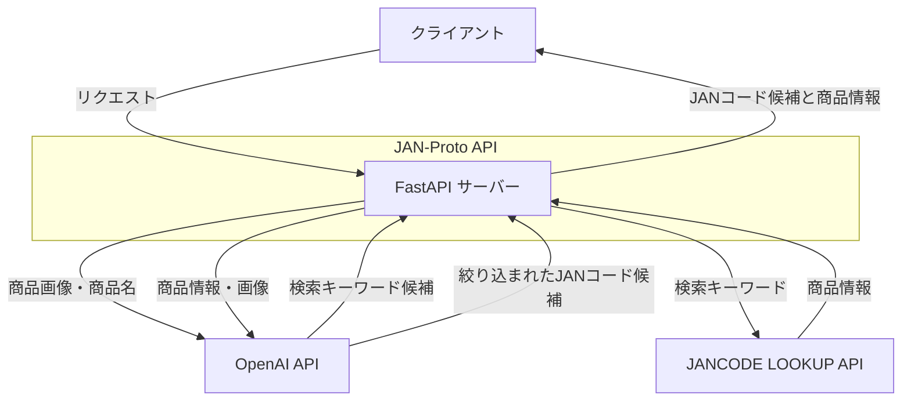
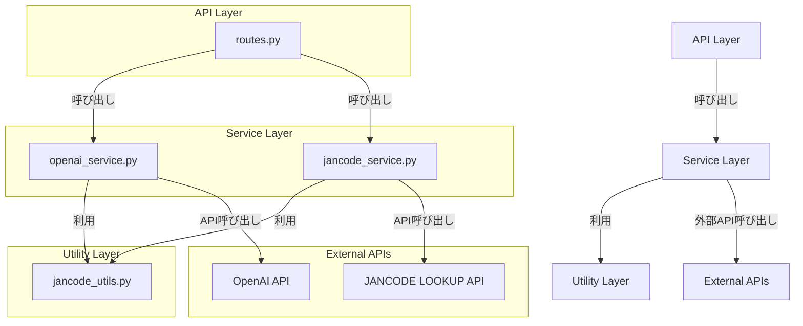
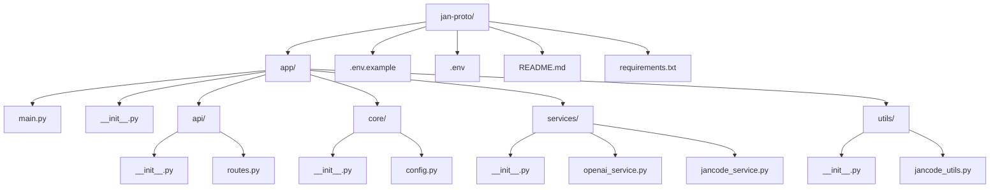
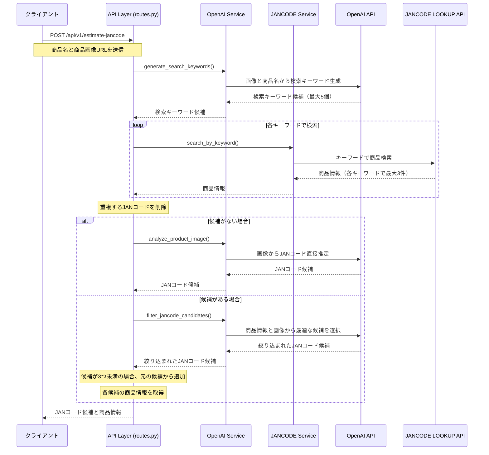
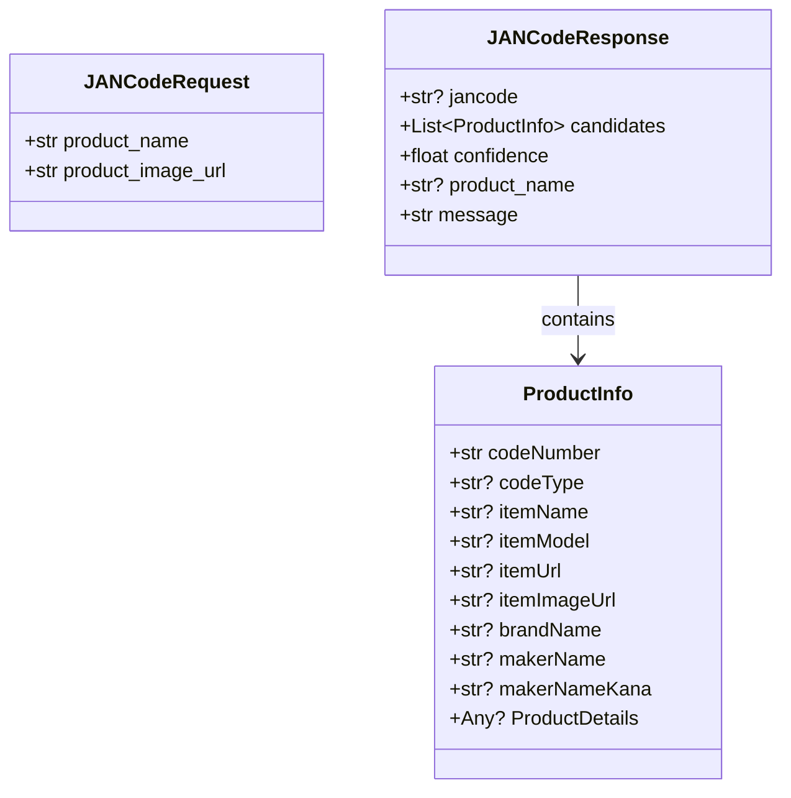

# JAN コード推定 API

商品名と商品画像から JAN コード（GTIN-13）を推定する API サーバーシステムです。

## 機能

- 商品名と商品画像を受け取り、JAN コードを推定
- 推定された JAN コードをレスポンスとして返却
- 推定 JAN コードが一意に定まらない場合は最低 3 つ、最大 5 つの候補を返却
- 各候補について JAN コードだけでなく、商品の詳細情報も返却

## 技術スタック

- Python 3.8+
- FastAPI
- OpenAI API (GPT-4o-mini)
- JANCODE LOOKUP API

## セットアップ

### 前提条件

- Python 3.8 以上
- OpenAI API キー
- JANCODE LOOKUP API アプリ ID

### インストール

1. リポジトリをクローン

```bash
git clone <repository-url>
cd jan-proto
```

2. 仮想環境を作成して有効化

```bash
python -m venv venv
source venv/bin/activate  # Linuxの場合
# または
venv\Scripts\activate  # Windowsの場合
```

3. 依存パッケージをインストール

```bash
pip install -r requirements.txt
```

4. 環境変数を設定

`.env.example`ファイルを`.env`にコピーし、必要な情報を入力します。

```bash
cp .env.example .env
```

`.env`ファイルを編集：

```
# OpenAI API設定
OPENAI_API_KEY=your_openai_api_key_here

# JANCODE LOOKUP API設定
JANCODE_API_APP_ID=your_jancode_api_app_id_here
```

## 使い方

### サーバーの起動

```bash
uvicorn app.main:app --reload
```

サーバーは`http://localhost:8000`で起動します。

### API ドキュメント

- Swagger UI: `http://localhost:8000/docs`
- ReDoc: `http://localhost:8000/redoc`

### API エンドポイント

#### JAN コード推定

```
POST /api/v1/estimate-jancode
```

**リクエスト** (JSON):

```json
{
  "product_name": "サンプル商品",
  "product_image_url": "https://example.com/images/sample-product.jpg"
}
```

**レスポンス**:

```json
{
  "jancode": "4901234567890",
  "candidates": [
    {
      "codeNumber": "4901234567890",
      "codeType": "JAN",
      "itemName": "サンプル商品A",
      "itemModel": "MODEL-A",
      "itemUrl": "https://www.jancodelookup.com/code/4901234567890/",
      "itemImageUrl": "https://image.jancodelookup.com/4901234567890.jpg",
      "brandName": "サンプルブランド",
      "makerName": "サンプルメーカー",
      "makerNameKana": "サンプルメーカー",
      "ProductDetails": []
    },
    {
      "codeNumber": "4902345678901",
      "codeType": "JAN",
      "itemName": "サンプル商品B",
      "itemModel": "MODEL-B",
      "itemUrl": "https://www.jancodelookup.com/code/4902345678901/",
      "itemImageUrl": "https://image.jancodelookup.com/4902345678901.jpg",
      "brandName": "サンプルブランド",
      "makerName": "サンプルメーカー",
      "makerNameKana": "サンプルメーカー",
      "ProductDetails": []
    },
    {
      "codeNumber": "4903456789012",
      "codeType": "JAN",
      "itemName": "サンプル商品C",
      "itemModel": "MODEL-C",
      "itemUrl": "https://www.jancodelookup.com/code/4903456789012/",
      "itemImageUrl": "https://image.jancodelookup.com/4903456789012.jpg",
      "brandName": "サンプルブランド",
      "makerName": "サンプルメーカー",
      "makerNameKana": "サンプルメーカー",
      "ProductDetails": []
    }
  ],
  "confidence": 0.95,
  "product_name": "サンプル商品A",
  "message": "JANコードが正常に推定されました。"
}
```

## 仕組み

1. 商品画像と商品名から OpenAI GPT-4o-mini を使用して検索キーワード候補を生成（最大 5 個）
2. 各キーワード候補で JANCODE LOOKUP API を呼び出し（各キーワードで最大 3 件、合計最大 15 件の商品情報を取得）
3. 得られた商品情報と商品画像を再度 OpenAI GPT-4o-mini に送り、最適な JAN コード候補を絞り込み
4. 候補が 3 つ未満の場合は、元の候補から追加して最低 3 つになるようにする
5. 各候補について JAN コードだけでなく、商品の詳細情報（商品名、メーカー名、画像 URL など）も含めてレスポンスとして返却

## アプリケーションアーキテクチャ

### システム構成図



### コンポーネント構成



### ディレクトリ構造



## 処理フロー詳細

### JAN コード推定プロセス



### データモデル



## 主要コンポーネントの説明

### OpenAI Service

OpenAI API との連携を行うサービスで、以下の主要な機能を提供します：

1. **generate_search_keywords**: 商品画像と商品名から検索キーワード候補を生成
2. **analyze_product_image**: 商品画像を分析し、JAN コードの候補を直接推定
3. **filter_jancode_candidates**: JAN コード候補リストから最適な候補を選択

### JANCODE Service

JANCODE LOOKUP API との連携を行うサービスで、以下の主要な機能を提供します：

1. **search_by_keyword**: キーワードによる商品検索
2. **search_by_code**: JAN コードによる商品検索
3. **get_product_info**: JAN コードから商品情報を取得

### JANCode Utils

JAN コードに関するユーティリティ関数を提供します：

1. **validate_jancode**: JAN コードの検証
2. **format_jancode**: JAN コードの正規化
3. **get_country_code**: JAN コードから国コードを取得

## ライセンス

MIT
